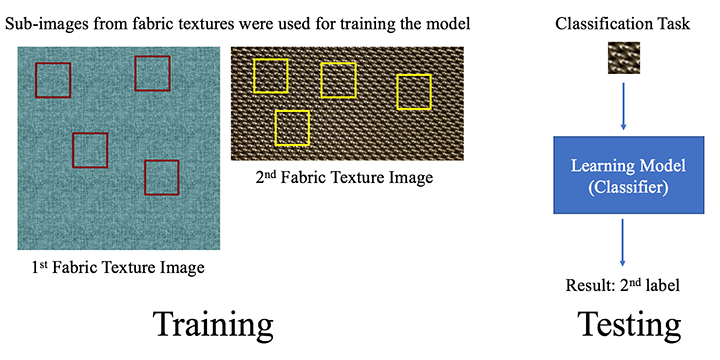

# FTRecogniser
Fabric Texture Recogniser(Term project of Signals and Systems)

This project aims to make a classifier that automatically label an unknown fabric texture image based on a set of previously known fabric texture images. This project makes the best use of an important attribute: every fabric texture has its own periodicity, which was one of the main reasons I used Fourier analysis to interpret images. 
Using a k-means clustering algorithm, I trained a classifier from a set of input texture images and determine labels of unclassified texture patterns using the learning model. The 2-D Fourier transform was used to extract frequency information from input fabric texture images. The frequency information was used to train the model. After building the model, the software used an input unknown fabric texture to calculate vector distances between the input image and every cluster. Then, the label of an input image is decided to be the index number of the cluster which is closest to the input image.

